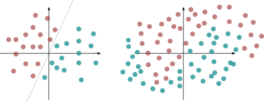

# Kernel PCA
Metode ini digunakan ketika pemisah berbentuk nonlinier, bukan linier seperti di PCA.




## Code
```
## Fitting Model
from sklearn.decomposition import KernelPCA
import pandas as pd
import seaborn as sns

kpca_model = KernelPCA(kernel="rbf", fit_inverse_transform=True, gamma=10)
pc_kpca = kpca_model.fit_transform(X) # PC
```

## Refference
1. https://nirpyresearch.com/pca-kernel-pca-explained/
2. https://scikit-learn.org/stable/modules/generated/sklearn.decomposition.KernelPCA.html
3. https://people.eecs.berkeley.edu/~wainwrig/stat241b/scholkopf_kernel.pdf

