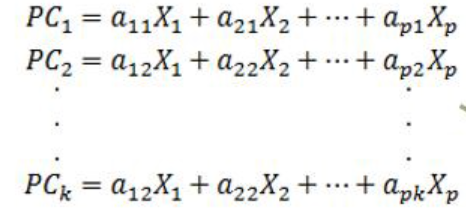

# Principle Component Analysis (PCA)
Dalam ilmu statistik, PCA termasuk ke dalam bahasan **Multivariate Analysis" sedangkan dalam machine learning termasuk ke dalam bahasan "Dimensionality Reduction".

## Definisi
Analisis Komponen Utama (PCA) merupakan teknik mereduksi data multivariat (banyak variabel) untuk mengubah (transformasi) suatu matriks data awal menjadi suatu set kombinasi linier yang lebih sedikit akan tetapi menyerap sebagian besar jumlah varians dari data awal (Supranto, 2010).

## Model matematis
PC1, PC2 dst adalah kombinasi linier dimana tidak ada korelasi yang kuat antara antar PC.



## Penentuan Banyaknya Component
Penentuan banuaknya komponen bisa berdasarkan
1. Teori dari praktisi
2. Nilai eigen yang lebih dari 1
3. Komulatif varians explained yang lebih dari 80%

## Code
```
## Fitting Model
from sklearn.preprocessing import StandardScaler
import pandas as pd
import seaborn as sns

x = StandardScaler().fit_transform(X)
pca_model = PCA(n_components=k).fit(x)
```

```
# Determine number of components
def getExplainedVariance(df,k):
    X = df.drop('Y',axis=1)
    Y = pd.DataFrame(df['Y'])
    x = StandardScaler().fit_transform(X) # scalling
    
    pca_model = PCA(n_components=k).fit(x) # set number of components
    vr = pd.DataFrame(pca_model.explained_variance_ratio_ *100) # get variance explained ratio
    ev = pd.DataFrame(pca_model.explained_variance_ ) # get eigenvalue
    cumsum_vr = pd.DataFrame(np.cumsum(vr))
    
    expl = pd.concat([vr,cumsum_vr,ev],axis=1)
    expl.reset_index(inplace=True)
    expl.columns = ['k','Variance Explained','Cumulative Variance Explained','Eigen Value']
    
    return expl
    
```


## Refference
1. Supranto. 2010. Analisis Multivariat Arti dan Interpretasi. Rineka Cipta: Jakarta.
2. https://arofiqimaulana.medium.com/perbedaan-pca-dan-analisis-faktor-64cfc51168c4

