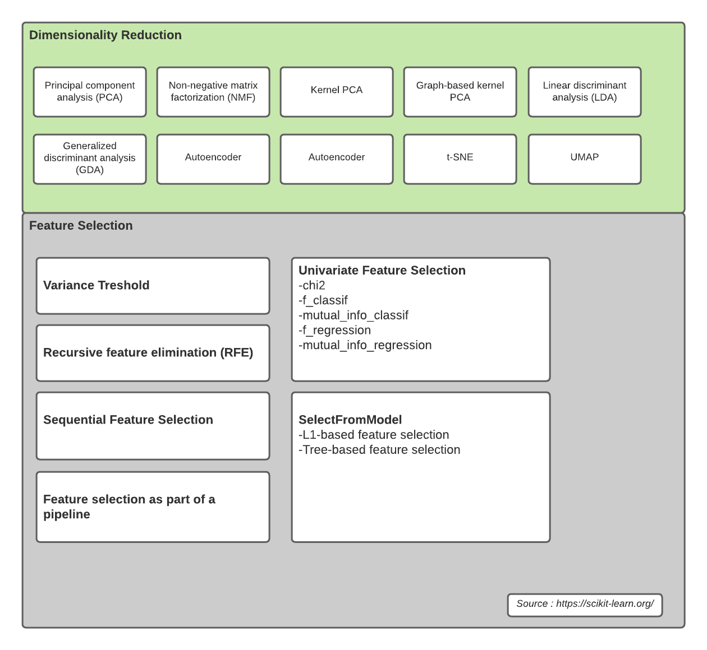

# Dimensionality Reduction

Salah satu masalah yang sering terjadi dalam suatu machine learning adalah “Curse of Dimensionality problem”, di mana mesin kesulitan dalam menangani sejumlah masukan data dengan dimesi yang sangat tinggi. Salah satu cara yang paling umum digunakan untuk menangani proses ini adalah dengan mengurangi dimensi dari data masukan dengan tetap menjaga informasi yang terkandung didalamnya. 

Mengurangi dimensi data bisa menggunakan teknik **Feature Selection** ataupun **Dimentionality Reduction**

## Algoritma
Beberapa teknik reduksi dimensi yang bisa digunakan adalah
1. Principal Component Analysis (PCA)
2. Non-Negative Matrix Factorization (NMF)
3. Kernel PCA
4. AutoEncoder
5. Linear discriminant analysis

## Feature Selection vs Dimentiooality Reduction
Keduanya memiliki fungsi yang sama untuk mengatasi dimensi data yang tinggi. Perbedaanya adalah **Dimentionality Reduction** mengatasi dimensi data yang tinggi dengan cara membentuk variabel baru, sedangkan **Feature Selection** tidak membentuk variabel baru namun hanya meng-eliminasi beberapa variabel saja.

## Type

## Refference
- https://towardsdatascience.com/feature-selection-and-dimensionality-reduction-f488d1a035de
- https://thenewstack.io/3-new-techniques-for-data-dimensionality-reduction-in-machine-learning/

